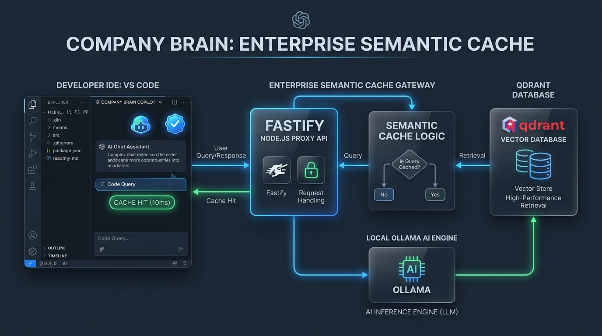
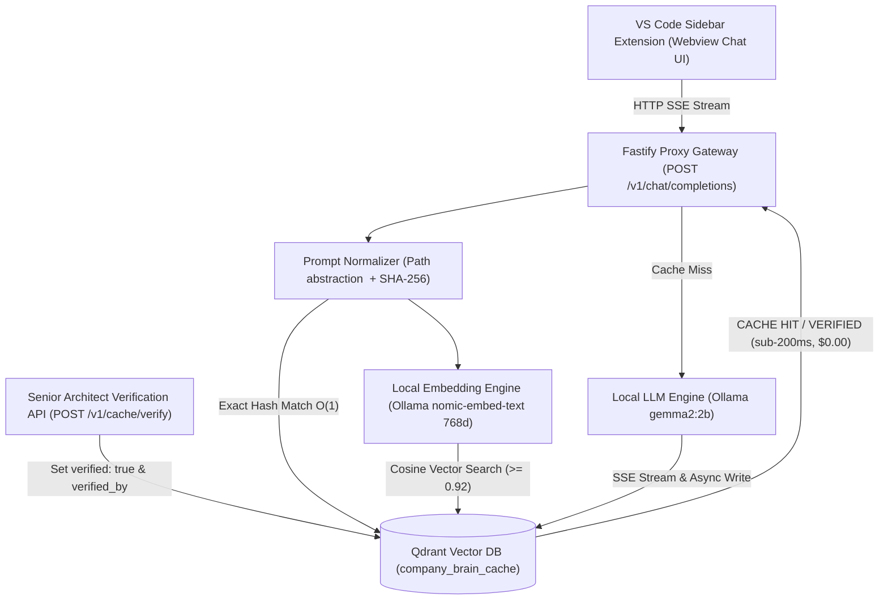

# Company Brain & Enterprise Semantic Cache Engine



**Company Brain** is a centralized intelligence proxy and semantic caching system designed to eliminate redundant LLM queries, reduce API token expenses by 30%–50%, and capture team memory directly inside developer IDEs (VS Code).

---

## 🎯 The Problem & Solution

### The Problem
Engineering teams repeatedly encounter identical bugs, stack traces, and framework edge cases. When Developer A solves an issue using an AI coding assistant, that solution remains isolated to their session. When Developer B encounters the exact same bug weeks later, the team incurs:
1. **Redundant LLM Token Expenses:** Repetitive API queries cost thousands of dollars monthly across engineering orgs.
2. **Context Window Latency Overhead:** Re-sending local workspace context and waiting 10–30 seconds for LLM generation reduces developer flow.
3. **Loss of Organizational Memory:** Solutions verified by senior architects are lost, leaving junior engineers with generic AI answers.

### The Solution
The **Company Brain** acts as a centralized proxy gateway and vector memory store. It introduces:
- **Sub-20ms Semantic Caching:** Instant zero-cost resolution for identical or semantically similar queries.
- **Path-Agnostic Prompt Normalization:** Abstracts developer laptop paths (`/Users/dev/...` vs `C:\Users\...` to `<FILE_PATH>`) so solutions match across different developer environments.
- **100% Local Inference & Embeddings:** Runs locally via **Ollama (`gemma2:2b`)** and **`nomic-embed-text`** on Apple Silicon (Mac M1/M2/M3) with $0 external API dependency.
- **Senior Architect Verification:** Allows tech leads to upvote and verify solutions (`POST /v1/cache/verify`), rendering a gold **`⭐ VERIFIED BY SENIOR ARCHITECT`** badge in VS Code.

---

## 🏗️ System Architecture & Workflow



---

## 📁 Repository Structure

```
SecondBrain/
├── docker-compose.yml              # Qdrant Vector Database service definition
├── docs/
│   └── architecture.jpg            # Architecture diagram asset
├── backend/                        # Node.js + Fastify + TypeScript proxy backend
│   ├── src/
│   │   ├── index.ts                # Fastify server entry point & CORS configuration
│   │   ├── routes/
│   │   │   └── chat.routes.ts      # SSE completion streaming & verification routes
│   │   ├── services/
│   │   │   ├── cache.service.ts    # Qdrant collection setup & hybrid search logic
│   │   │   └── embedding.service.ts # Ollama nomic-embed-text & fallback vectors
│   │   ├── utils/
│   │   │   └── normalizer.ts       # Path abstraction & SHA-256 prompt hashing
│   │   └── scripts/
│   │       └── seed-ki.ts          # Knowledge Items pre-indexing script
│   ├── package.json
│   └── tsconfig.json
└── vscode-extension/               # VS Code Sidebar Chat Extension
    ├── src/
    │   ├── extension.ts            # Extension activation entry point
    │   └── BrainSidebarProvider.ts # Sidebar Webview provider & SSE stream rendering
    ├── media/
    │   └── icon.svg                # Custom Brain activity bar icon
    ├── package.json
    └── tsconfig.json
```

---

## 🚦 Built Implementation Phases

### Phase 1: Local Infrastructure Setup
- Deployed **Qdrant Vector Database** (`qdrant/qdrant:v1.9.2`) via Docker Compose listening on port `6333` (HTTP) and `6334` (gRPC).

### Phase 2: Backend Core Engine & Prompt Normalization
- **Prompt Normalizer**: Converts machine-specific paths to `<FILE_PATH>` and calculates a SHA-256 hex string digest for $O(1)$ exact match evaluation.
- **Hybrid Cache Service**: Combines exact SHA-256 hash lookup with Cosine vector similarity search (threshold $\ge 0.92$).

### Phase 3: Token Streaming Proxy Gateway
- Implements `POST /v1/chat/completions` exposing Server-Sent Events (`text/event-stream`).
- On **Cache Miss**: Streams tokens from local Ollama `gemma2:2b` and asynchronously saves the response into Qdrant vector memory.
- On **Cache Hit**: Serves the stored fix in sub-200ms with custom SSE metadata.

### Phase 4: VS Code Extension Sidebar
- Registered Webview View Provider (`companyBrain.chatView`) in VS Code's Activity Bar.
- Supports multi-turn conversation memory (`conversationHistory`) and renders real-time stream text with dynamic status badges:
  - **`⭐ VERIFIED BY STAFF INFRASTRUCTURE ARCHITECT`** (Gold)
  - **`⚡ CACHE HIT (10ms, $0.00)`** (Green)
  - **`🤖 LLM GENERATED`** (Purple)

### Phase 5: Knowledge Bank & Verification Hooks
- Exposes `POST /v1/cache/verify` endpoint to allow tech leads to upvote and verify answers.
- Added `npm run seed:ki` script to pre-index official enterprise fixes into Qdrant memory on day 1.

---

## ⚡ Quick Start & Development Setup

### 1. Prerequisites
- Docker & Docker Compose installed and running.
- Node.js (v20+) & `npm`.
- Ollama installed with models `gemma2:2b` and `nomic-embed-text`:
  ```bash
  ollama pull gemma2:2b
  ollama pull nomic-embed-text
  ```

### 2. Start Qdrant Vector DB
```bash
docker compose up -d
```
Verify health status:
```bash
curl http://127.0.0.1:6333/healthz
```

### 3. Install & Start Backend Proxy
```bash
cd backend
npm install
npm run dev
```
The server will run at `http://localhost:3000`.

### 4. (Optional) Seed Pre-Verified Enterprise Solutions
```bash
cd backend
npm run seed:ki
```

### 5. Launch VS Code Sidebar Extension
1. Open the project in VS Code.
2. Press **`fn` + `F5`** (or go to **Run $\rightarrow$ Start Debugging**).
3. A new `[Extension Development Host]` VS Code window will pop up.
4. Click the **Brain Icon 🧠** in the left Activity Bar to open the chat panel!

---

## 🧪 Testing & Verification Commands

### Test 1: Query Pre-Verified Solution
```bash
curl -i -N -X POST http://127.0.0.1:3000/v1/chat/completions \
  -H "Content-Type: application/json" \
  -d '{"messages":[{"role":"user","content":"How to fix ECONNRESET in PostgreSQL connection pool /home/ubuntu/db.ts?"}], "repo_id":"vscode-workspace"}'
```
*Expected Output*: Headers include `X-Cache-Status: HIT` and `X-Cache-Verified: true`.

### Test 2: Verify Any Answer in Database
```bash
curl -X POST http://127.0.0.1:3000/v1/cache/verify \
  -H "Content-Type: application/json" \
  -d '{"prompt": "hello my name is chaitanya please remember this", "verified_by": "Chaitanya (Tech Lead)"}'
```

### Test 3: Inspect Qdrant Collection Points Directly
```bash
curl -X POST http://localhost:6333/collections/company_brain_cache/points/scroll \
  -H "Content-Type: application/json" \
  -d '{"limit": 10, "with_payload": true}'
```

---

## 📄 License
Internal Enterprise License - Senior AI Engineering Team.
